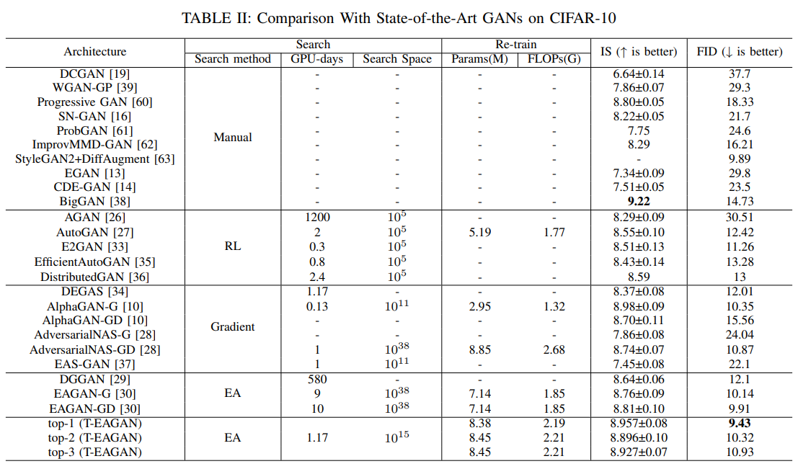
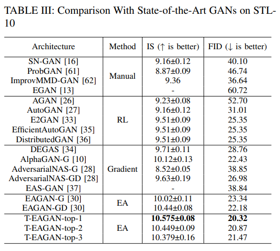

# SCGAN
**This paper has just been received, and I will complete it as soon as possible.**
## Code used for "SCGAN: Sampling and Clustering-based Neural Architecture Search for GANs".

# Introduction
The evolutionary neural architecture search for generative adversarial networks (GANs) has demonstrated promising performance for generating high-quality images. However, two challenges persist, including the long search times and unstable search results. To alleviate these problems, this paper proposes a sampling and clustering-based neural architecture search algorithm for GANs, named SCGAN, which can significantly improve searching efficiency and enhance generation quality. Two improved strategies are proposed in SCGAN. First, a constraint sampling strategy is designed to limit the parameter capacity of architectures, which calculates their architecture size and discards those exceeding a reasonable parameter threshold. Second, a clustering selection strategy is applied in each architecture iteration, which integrates a decomposition selection mechanism and a hierarchical clustering mechanism to further improve search stability. Extensive experiments on the CIFAR-10 and STL-10 datasets demonstrated that SCGAN only requires 0.4 GPU days to find a promising GAN architecture in a vast search space including approximately 10$^{15}$ networks. Our best-found GAN outperformed those obtained by other neural architecture search methods with performance metric results (IS=9.68±0.06, FID=5.54) on CIFAR-10 and (IS=12.12±0.13, FID=12.54) on STL-10.  

# Framework
Fig:framework for SCGAN

# Performance
<!-- 这是注释   -->
picture1

picture2

# Set-Up 
## 1.environment requirements:
The search environment is consistent with CAGAN，to run this code, you need:  
- PyTorch 2.0  
- TensorFlow 2.12.0  
- cuda 12.0  

Other requirements are in environment.yaml 

<!-- install code  -->
<pre><code>conda env create -f environment.yaml
</code></pre>

## 2.prepare fid statistic file
you need to create "fid_stat" directory and download the statistical files of real images.
<pre><code>mkdir fid_stat
</code></pre>

# How to search the  architecture by yourself
## 1. Search on CIFAR-10
<pre><code>bash search_arch_generator.sh
</code></pre>
# How to train the discovered architecture reported in the paper
## 1. Fully train GAN on CIFAR-10
<pre><code>bash ./scripts/train_arch_cifar10.sh
</code></pre>
## 2. Fully train GAN on STL-10
<pre><code>bash ./scripts/train_arch_stl10.sh
</code></pre>

# How to test the discovered architecture reported in the paper
## 1. Fully train GAN on CIFAR-10
<pre><code>bash ./scripts/test_arch_cifar10.sh
</code></pre>
## 2. Fully train GAN on STL-10
<pre><code>bash ./scripts/test_arch_stl10.sh
</code></pre>

# Acknowledgement
Some of the codes are built by:

1.[EAGAN](https://github.com/marsggbo/EAGAN)

2.[AlphaGAN](https://github.com/yuesongtian/AlphaGAN)

3.[Inception Score](https://github.com/openai/improved-gan/tree/master/inception_score) code from OpenAI's Improved GAN (official).

4.[FID Score](https://github.com/bioinf-jku/TTUR) code and CIFAR-10 statistics file from  (official).

Thanks them for their great works!
